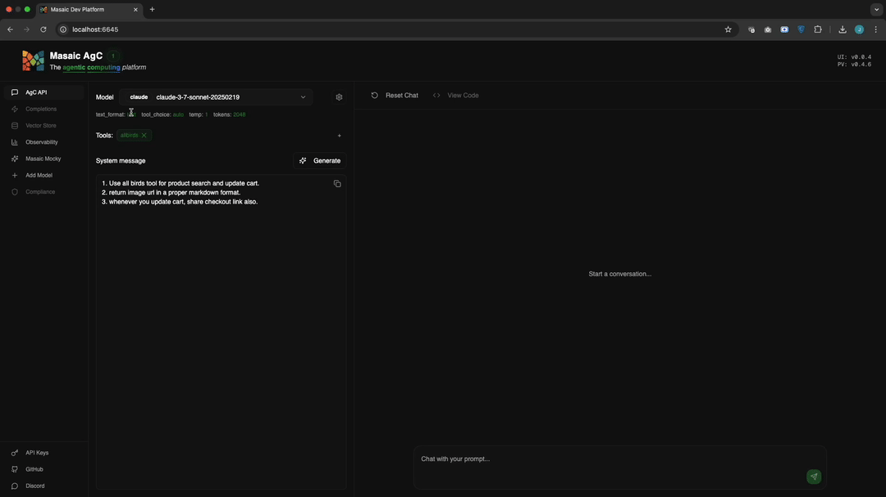

# AgC - Open Agentic Compute Platform

[](https://discord.com/channels/1335132819260702723/1354795442004820068)
[](https://github.com/orgs/masaic-ai-platform/discussions)
[](https://hub.docker.com/r/masaicai/open-responses/tags)
[](https://hub.docker.com/r/masaicai/platform-ui/tags)

**AgC** is the open-core platform that powers **Open Agentic Compute** — a new compute substrate purpose-built for deploying, running, and orchestrating AI agents at scale.

AgC treats agents as first-class compute units. Think of it as what EC2 did for VMs — but for agents. Modular, observable, cloud-neutral, and production-ready.

---

## 🚀 What is Open Agentic Compute?



**Open Agentic Compute** is an open infrastructure layer designed for the age of intelligent, autonomous systems. It provides:

- ⚙️ A pluggable **Agent Runtime**
- 🧠 Integrated **Memory Systems** (long-term, episodic, vector)
- 🪄 Dynamic **Model Routing** (multi-LLM support)
- 🔁 Multi-agent **Orchestration**
- 📈 Built-in **Tracing & Observability**
- 🧪 Sandboxed **Testing & Replay**
- 🔐 **Security, control, and modular governance**

All of this is delivered in a fully deployable platform with a single goal:
> **Empower developers and organizations to run agents like cloud-native workloads — at scale, and without lock-in.**

---

## 🏗️ Project Structure

### Core Components

| Component           | Description                                                                                           | Documentation |
|---------------------|-------------------------------------------------------------------------------------------------------|---------------|
| **Platform Server** | Agentic orchestration API layer with built-in tools like file search, agentic file search, MCP server | [Platform README](platform/README.md) |
| **Platform UI**     | Web interface for agent development and management                                                    | [UI README](ui/README.md) |
| **Deployment**      | Docker Compose configurations for various deployment modes                                            | [Deploy README](deploy/README.md) |

---

## 🚀 Quick Start

### Option 1: Docker Compose (Recommended)

```bash
# Clone the repository
git clone https://github.com/openagenticcompute/AgC.git
cd AgC

# Start with default configuration
cd deploy
docker-compose up

# Access the platform
# UI: http://localhost:6645
# API: http://localhost:6644
```

### Option 2: Individual Components

#### Platform  API
```bash
# Run the API server
docker run -p 6644:6644 masaicai/open-responses:latest
```

#### Platform UI
```bash
cd ui
npm install
npm run dev
# Access at http://localhost:6645
```

---

## 📚 Documentation

- **[Platform Documentation](platform/README.md)** - OpenResponses API details and capabilities
- **[UI Documentation](ui/README.md)** - Platform UI setup and configuration
- **[Deployment Guide](deploy/README.md)** - Docker Compose deployment options

---

## 💬 What Engineers Are Saying

> "Masaic OpenResponses is one of the few platforms that supports the `/responses` API even when the backend (like Ollama) **doesn't — but might in the future**. It handles server-side tools like search and supports stateful agent processing — two huge wins. Bonus: it even integrates with OpenTelemetry out of the box. The team is responsive and fast-moving."  
> — **[Adrian Cole](https://www.linkedin.com/posts/adrianfcole_openai-opentelemetry-activity-7328071653249228805-F0q-)**, Principal Engineer, Elastic

---

## 📝 Feedback

We'd love to hear your feedback! Please take a moment to fill out our [feedback form](https://forms.gle/yBi9JuyCVbKYBRZS9) - it takes less than 4 minutes.

---

## 🙌 Help Us Grow

If you find AgC useful, please consider giving it a star ⭐ — it helps others discover it and supports the community!

## 🤝 Contributing

Contributions are welcome! Please feel free to submit a Pull Request.

---

## 📄 License

This project is licensed under the Apache License 2.0 - see the [LICENSE](LICENSE) file for details.

---

<p align="center">
  Made with ❤️ by the Masaic AI Team
</p>
