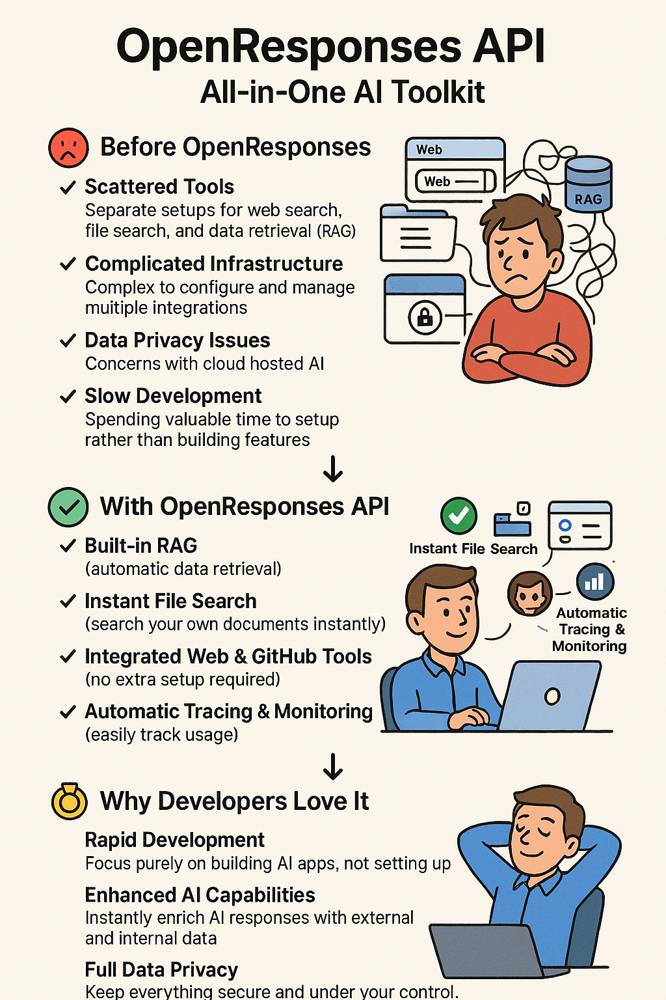

# OpenResponses API



> **Unlock enterprise-grade AI capabilities through a single, powerful API — simplify development, accelerate deployment, and maintain complete data control**

[](https://discord.com/channels/1335132819260702723/1354795442004820068)
[](https://github.com/orgs/masaic-ai-platform/discussions)

## Overview

OpenResponses revolutionizes how developers build AI applications by providing a comprehensive, production-ready toolkit with essential enterprise features—all through an elegantly simplified API interface. Stop cobbling together disparate tools and start building what matters.

## 🚀 Getting Started

Run OpenResponses locally to access an OpenAI-compatible API that works seamlessly with multiple model providers and supports unlimited tool integrations. Deploy a complete AI infrastructure on your own hardware with full data sovereignty.

### Run with Docker

```bash
docker run -p 8080:8080 masaicai/open-responses:latest
```

### Using with OpenAI SDK

```python
openai_client = OpenAI(base_url="http://localhost:8080/v1", api_key=os.getenv("OPENAI_API_KEY"), default_headers={'x-model-provider': 'openai'})

response = openai_client.responses.create(
    model="gpt-4o-mini",
    input="Write a poem on Masaic"
)
```

### Using with OpenAI Agent SDK

```python
client = AsyncOpenAI(base_url="http://localhost:8080/v1", api_key=os.getenv("OPENAI_API_KEY"), default_headers={'x-model-provider': 'openai'})
agent = Agent(
    name="Assistant",
    instructions="You are a humorous poet who can write funny poems of 4 lines.",
    model=OpenAIResponsesModel(model="gpt-4o-mini", openai_client=client)
)
```

### Using with cURL

```bash
curl --location 'http://localhost:8080/v1/responses' \
--header 'Content-Type: application/json' \
--header 'Authorization: Bearer OPENAI_API_KEY' \
--header 'x-model-provider: openai' \
--data '{
    "model": "gpt-4o",
    "stream": false,
    "input": [
        {
            "role": "user",
            "content": "Write a poem on Masaic"
        }
    ]
}'
```
For detailed implementation instructions, see our [Quick Start Guide](docs/Quickstart.md).

## Table of Contents

- [Getting Started](#-getting-started)
- [Core Capabilities](#core-capabilities)
- [Key Problems Solved](#key-problems-solved)
- [Why Engineering Teams Should Choose OpenResponses](#why-engineering-teams-should-choose-openresponses)
- [API Reference](#api-reference)
- [Coming Soon](#-coming-soon)
- [Frequently Asked Questions](#-frequently-asked-questions)
- [Configuration](#️#-configuration)
- [Documentation](#-documentation)
- [Local Development](#-local-development)
- [Production Use](#-production-use)
- [Contributing](#-contributing)
- [License](#-license)

## Core Capabilities

| Feature | Description | Benefit |
|---------|-------------|---------|
| **Automated Tracing** | Comprehensive request and response monitoring | Track performance and usage without additional code |
| **Integrated RAG** | Contextual information retrieval | Enhance responses with relevant external data automatically |
| **Pre-built Tool Integrations** | Web search, GitHub access, and more | Deploy advanced capabilities instantly |
| **Self-Hosted Architecture** | Full control of deployment infrastructure | Maintain complete data sovereignty |
| **OpenAI-Compatible Interface** | Drop-in replacement for existing OpenAI implementations | Minimal code changes for migration |

## Key Problems Solved

### Development Challenges
- **Feature Gap**: Most open-source AI models lack critical enterprise capabilities required for production environments
- **Integration Complexity**: Implementing supplementary features like retrieval augmentation and monitoring requires significant development overhead
- **Resource Diversion**: Engineering teams spend excessive time on infrastructure rather than core application logic

### Operational Concerns
- **Data Privacy**: Organizations with sensitive data face compliance barriers when using cloud-hosted AI services
- **Operational Control**: Many applications require full control over the AI processing pipeline

## Why Engineering Teams Should Choose OpenResponses

- **Developer Productivity**: Focus engineering efforts on application features rather than infrastructure
- **Production Readiness**: Enterprise capabilities and batteries included out-of-the-box
- **Compliance Confidence**: Deploy with data privacy requirements fully addressed
- **Simplified Architecture**: Consolidate AI infrastructure through widely used OpenAI API Specifications

## API Reference

The API implements the following OpenAI-compatible endpoints:

| Endpoint | Description |
|----------|-------------|
| `POST /v1/responses` | Create a new model response | 
| `GET /v1/responses/{responseId}` | Retrieve a specific response | 
| `DELETE /v1/responses/{responseId}` | Delete a response | 
| `GET /v1/responses/{responseId}/input_items` | List input items for a response | 

### More Example API Calls

Replace the placeholder API keys with your own values.

#### Groq Example (with Streaming)
```bash
curl --location 'http://localhost:8080/v1/responses' \
--header 'Content-Type: application/json' \
--header 'Authorization: Bearer GROQ_API_KEY' \
--data '{
    "model": "llama-3.2-3b-preview",
    "stream": true,
    "input": [
        {
            "role": "user",
            "content": "Write a poem on OpenResponses"
        }
    ]
}'
```

#### Claude Example
```bash
curl --location 'http://localhost:8080/v1/responses' \
--header 'Content-Type: application/json' \
--header 'Authorization: Bearer ANTHROPIC_API_KEY' \
--header 'x-model-provider: claude' \
--data '{
    "model": "claude-3-5-sonnet-20241022",
    "stream": false,
    "input": [
        {
            "role": "user",
            "content": "Write a poem on OpenResponses"
        }
    ]
}'
```

### Using Tools in API Calls

```bash
curl --location 'http://localhost:8080/v1/responses' \
--header 'Content-Type: application/json' \
--header 'Authorization: Bearer YOUR_API_KEY' \
--data '{
    "model": "your-model",
    "stream": false,
    "tools": [
        {
            "type": "brave_web_search"
        }
    ],
    "input": [
        {
            "role": "user",
            "content": "What are the latest developments in AI?"
        }
    ]
}'
```

## 🔮 Coming Soon

We're continuously evolving OpenResponses with powerful new features to elevate your AI applications even further. Stay tuned!

## ❓ Frequently Asked Questions

### Can I use my existing provider API keys?
Yes! OpenResponses acts as a pass-through to the provider APIs using your own keys.

### Is there any performance penalty?
Our benchmarks show minimal overhead compared to direct API calls.

### How do I handle errors?
OpenResponses standardizes error responses across providers:
```json
{
  "type": "rate_limit_exceeded",
  "message": "Rate limit exceeded. Please try again in 30 seconds.",
  "param": null,
  "code": "rate_limit"
}
```

## ⚙️ Configuration

The application supports the following environment variables:

| Variable                       | Description                                   | Default |
|--------------------------------|-----------------------------------------------|---------|
| `MCP_SERVER_CONFIG_FILE_PATH`  | Path to MCP server configuration              | -       |
| `MASAIC_MAX_TOOL_CALLS`        | Maximum number of allowed tool calls          | 10      |
| `MASAIC_MAX_STREAMING_TIMEOUT` | Maximum streaming timeout in ms               | 60000   |
| `SPRING_PRODFILES_ACTIVE`      | `otel` profile enables open telemetry exports | -       |

For more details on granular configurations refer:
- [application.properties](https://github.com/masaic-ai-platform/open-responses/blob/main/src/main/resources/application.properties)
- [application-otel.properties](https://github.com/masaic-ai-platform/open-responses/blob/main/src/main/resources/application-otel.properties)
## 📚 Documentation

Explore our comprehensive [documentation](docs/Doc-Index.md) to learn more about OpenResponses features, configuration options, and integration methods.

## 💻 Local Development

Follow these instructions to set up the project locally for development:

### Prerequisites

- Java JDK 21+
- [Gradle](https://gradle.org/) (optional, as project includes Gradle Wrapper)
- [Docker](https://www.docker.com/) (optional, for containerized setup)

### Steps

1. **Clone the repository**

```bash
git clone https://github.com/masaic-ai-platform/open-responses.git
cd open-responses
```

2. **Build the project**

Use the Gradle Wrapper included in the project:

```bash
./gradlew build
```

3. **Configure Environment Variables**

Create or update the `application.properties` file with necessary configuration under `src/main/resources`:

```properties
server.port: 8080
```

Set any additional configuration required by your project.

4. **Run the server**

To start the server in development mode:

```bash
./gradlew bootRun
```

### Docker Setup (Optional)

Build and run the application using Docker:

```bash
./gradlew build
docker build -t openresponses .
docker run -p 8080:8080 -d openresponses
```

### Testing

Run the tests with:

```bash
./gradlew test
```

## ⚠️ Production Use

>  **Alpha Release Disclaimer**: This project is currently in alpha stage. The API and features are subject to breaking changes as we continue to evolve and improve the platform. While we strive to maintain stability, please be aware that updates may require modifications to your integration code.

## 🤝 Contributing

Contributions are welcome! Please feel free to submit a Pull Request.

> **"Alone we can do so little; together we can do so much."** — Helen Keller

## 📄 License

This project is licensed under the Apache License 2.0 - see the LICENSE file for details.

---

<p align="center">
  Made with ❤️ by the Masaic AI Team
</p>
