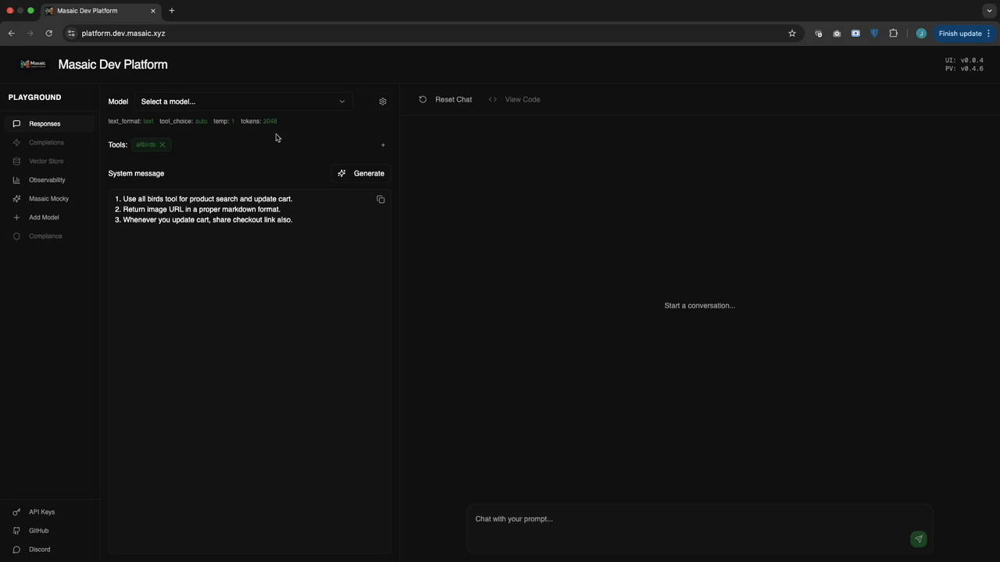
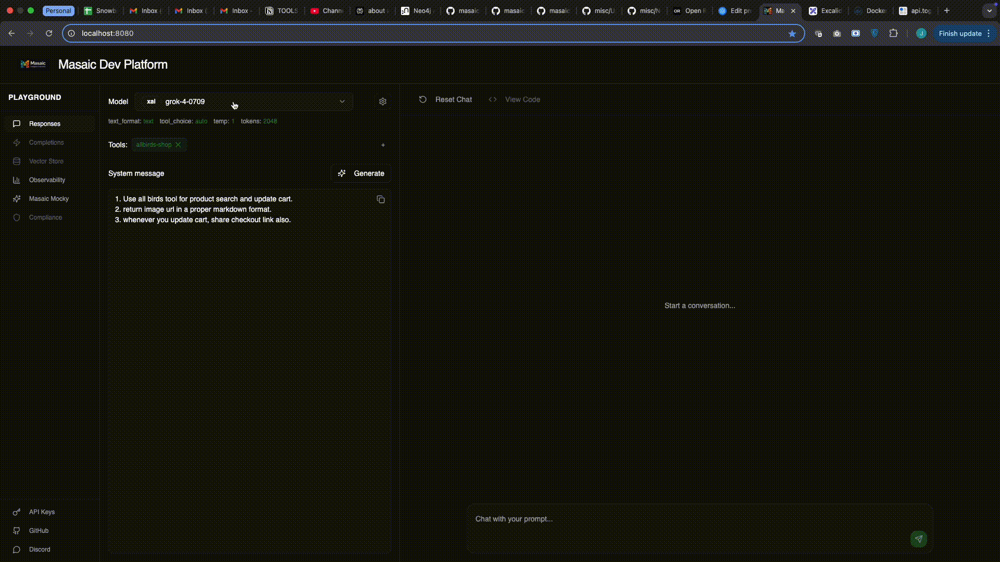
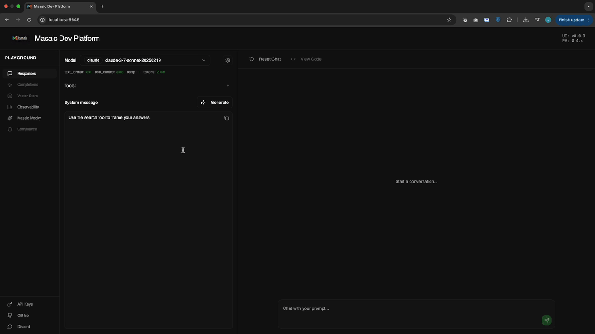

# Platform - Docker Compose Setup

## Prerequisites

- Docker and Docker Compose installed
- Required ports must be available on your host system:
  - **6644** (Open Responses API)
  - **6645** (Platform UI)
- See [Cleanup Commands](#cleanup) at the end if you need to remove existing containers/images.

## Deployment Modes

| Mode | Profile(s) | Services | Use Case                                        |
|------|------------|----------|-------------------------------------------------|
| 1. Default | `default` | open-responses, platform-ui | Basic local testing                             |
| 2. Qdrant | `qdrant` | open-responses-vector, qdrant, platform-ui | Vector search with Qdrant                       |
| 3. MongoDB | `mongo` | open-responses-mongo, mongo, platform-ui | chat messages persistence with MongoDB          |
| 4. Full | `full` | open-responses-full, mongo, qdrant, platform-ui | Full stack (vector + chat messages persistence) |
| 5. External | `external` | open-responses-external, platform-ui | Use external Qdrant/MongoDB                     |
| 6. Hybrid | `mongo,external` or `qdrant,external` | Mix of internal/external DBs | Custom hybrid setup                             |

---

## How to Run Each Deployment Mode

### 1. Default (Basic)
```sh
docker-compose up
```

### 2. Qdrant (Vector Search)
```sh
docker-compose --profile qdrant up
```

### 3. MongoDB (Persistence)
```sh
docker-compose --profile mongo up
```

### 4. Full (Qdrant + MongoDB)
```sh
docker-compose --profile full up
```

### 5. External (External Qdrant/MongoDB)
```sh
docker-compose --profile external up
```

### 6. Hybrid (Mix Internal/External)
- **External Qdrant, Internal MongoDB:**
  ```sh
  docker-compose --profile mongo --profile external up
  ```
- **Internal Qdrant, External MongoDB:**
  ```sh
  docker-compose --profile qdrant --profile external up
  ```

**To bring down a mode, use the same profile(s) with `down`:**
```sh
docker-compose down
# or, for a specific mode:
docker-compose --profile full down
# ...etc.
```
----

# Use Cases

## 1. Add Model: Add your own model with built-in test


**Steps**
1. Add model base url, example: if /chat/completions is available at http://example.com/v1/chat/completions then add http://example.com/v1
2. Built-in model connectivity test runs.
3. Save model and use it to build use cases.

## 2. Ecommerce: Product Search and Add to Cart in One Shot (Grok4)



**System Prompt:**
```bash
1. Use all birds tool for product search and update cart.
2. Return image URL in a proper markdown format.
3. Whenever you update cart, share checkout link also.
```

**MCP Server:**
```bash
https://allbirds.com/api/mcp
```

**Sample Query:**
```bash
Add men's black runner jet black, black sole of size 9 in the cart.
```

---

## 3. File Search Tool, In-Built RAG



**System Prompt:**
```bash
Use file search tool to frame your answers
```

**On File Search Tool Modal:**

1. Create vector store, using '+' icon.
2. Select embedding model.
3. Upload file to store.
4. Select store and file and generate embeddings using 'Associate File CTA'
5. Select vector store and save the tool

**Sample Query:**
Ask relevant query which will invoke file search tool.

---

## 4. Generating Mock Tools Using Masaic Mocky


Once a mock is generated, create an MCP server and then use the MCP server to create a simulation.

---

## Configure Environment Variables

> **Note:** You only need to configure these variables if you want to connect to existing (external) services like Qdrant or MongoDB, or override the defaults.

All variables are set in `.env.example` (copy to `.env` and edit as needed):

| Variable | Description |
|----------|-------------|
| `VITE_DASHBOARD_API_URL` | Dashboard API URL for the UI (default: http://localhost:6644) |
| `SPRING_PROFILES_ACTIVE` | Spring profile for open-responses (default: platform) |
| `OPEN_RESPONSES_STORE_VECTOR_SEARCH_QDRANT_HOST` | Qdrant host (service name or external host) |
| `OPEN_RESPONSES_STORE_VECTOR_SEARCH_QDRANT_API_KEY` | Qdrant API key (if using managed Qdrant) |
| `OPEN_RESPONSES_STORE_VECTOR_SEARCH_QDRANT_USE_TLS` | Use TLS for Qdrant (true/false, default: false) |
| `OPEN_RESPONSES_STORE_VECTOR_SEARCH_COLLECTION_NAME` | Qdrant collection name (default: open_responses) |
| `OPEN_RESPONSES_MONGODB_URI` | MongoDB URI (service name or external URI) |
| `OPEN_RESPONSES_MONGODB_DATABASE` | MongoDB database name (default: open_responses) |

---

## Accessing the Application

- **Platform UI:** [http://localhost:6645](http://localhost:6645)
- **Open Responses API:** [http://localhost:6644](http://localhost:6644)

---

## Cleanup

If you need to remove all containers and images for a fresh start:

```sh
# Stop and remove all containers for this project
# (use the same profiles as you used for 'up', if needed)
docker-compose down -v

# Remove any containers using the images (force)
docker ps -a --filter ancestor=masaicai/open-responses:latest --format "{{.ID}}" | xargs -r docker rm -f
docker ps -a --filter ancestor=masaicai/platform-ui:latest --format "{{.ID}}" | xargs -r docker rm -f

# Remove the images (force)
docker rmi -f masaicai/open-responses:latest masaicai/platform-ui:latest
``` 
