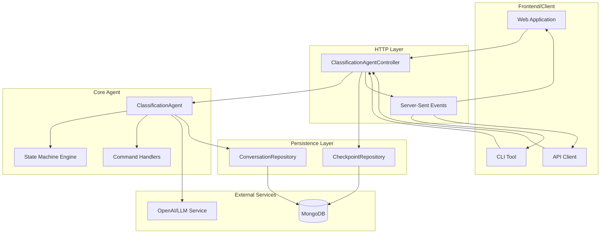
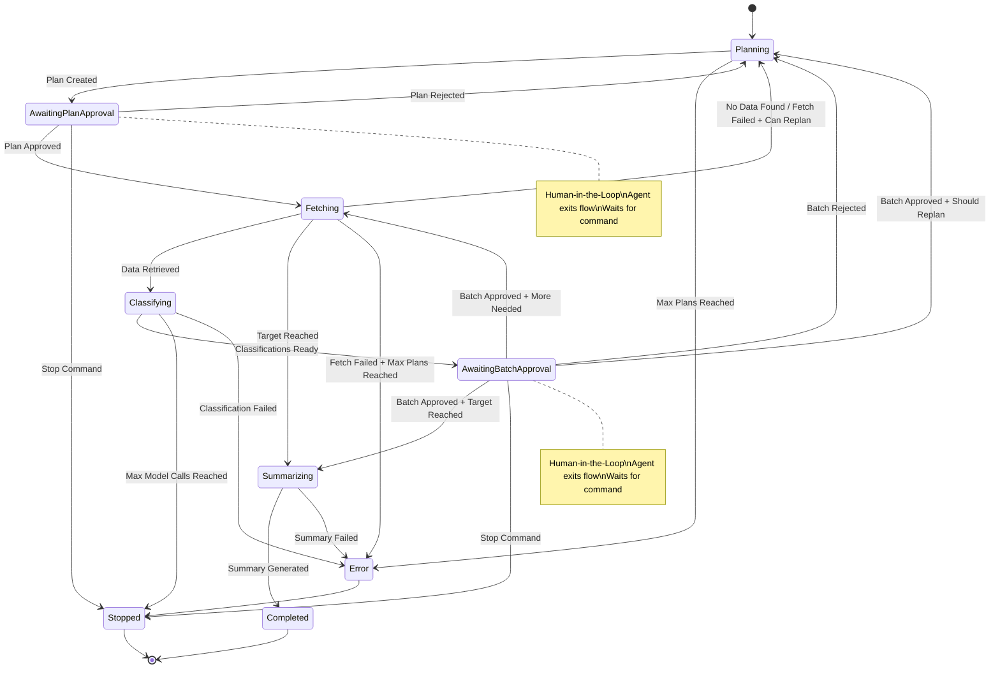
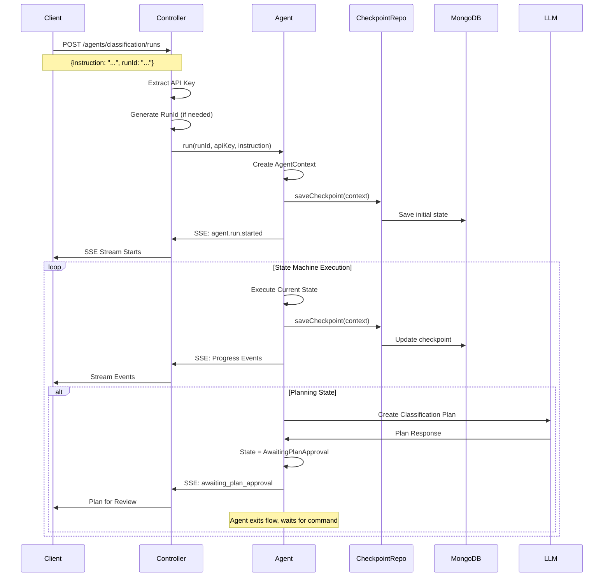
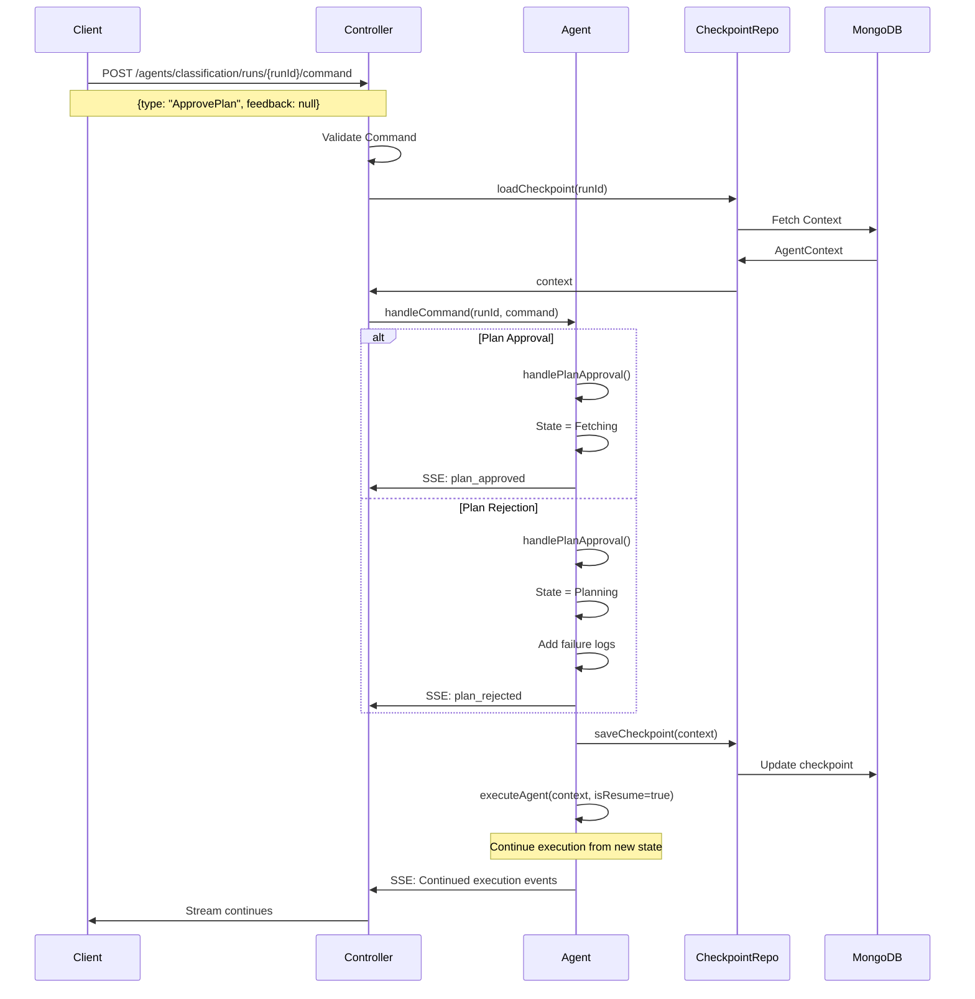
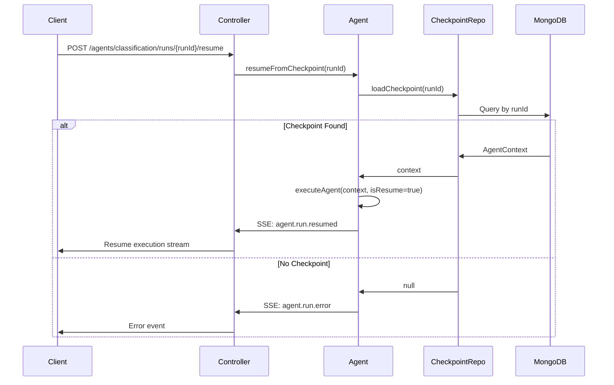
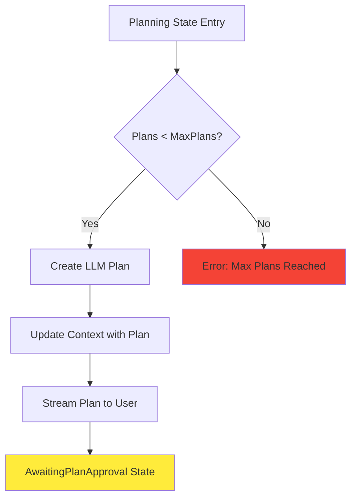
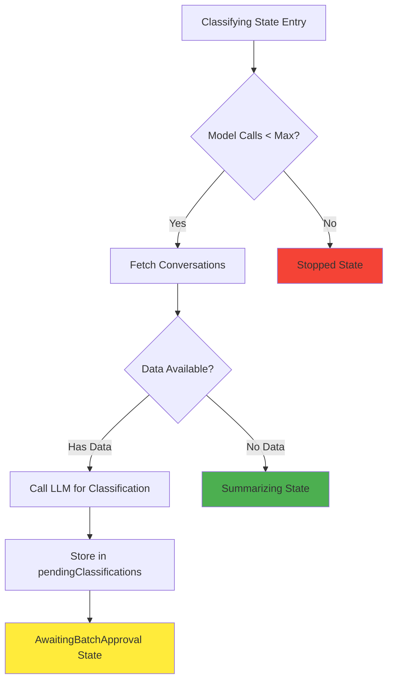
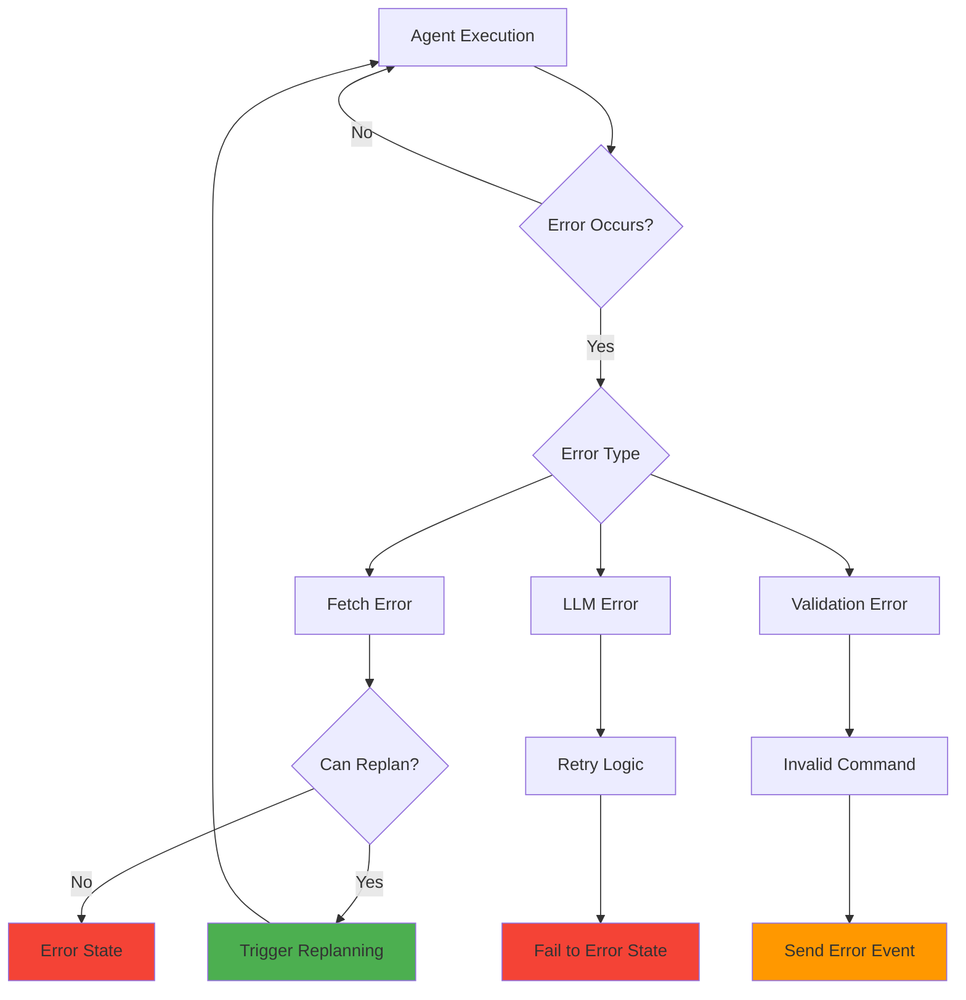
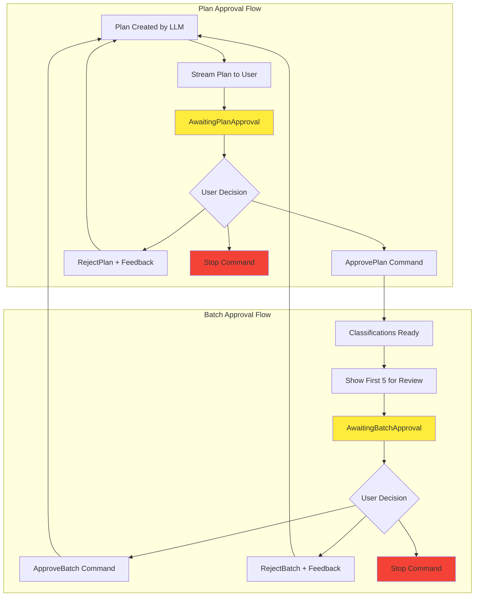
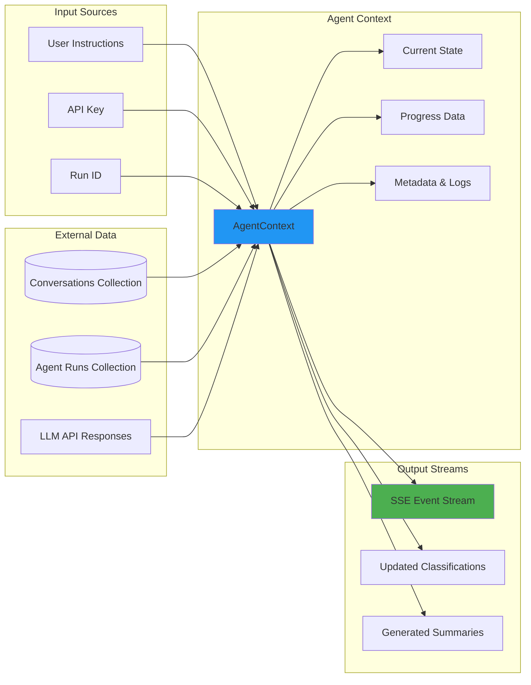

# ClassificationAgent Workflow Diagrams

This document provides visual representations of the ClassificationAgent's workflow, state transitions, API interactions, and checkpoint persistence mechanisms.

## 1. Overall System Architecture



## 2. State Machine Flow



## 3. API Interaction Flow

### 3.1 Start New Run



### 3.2 Human-in-the-Loop Command Flow



### 3.3 Resume from Checkpoint



## 4. State Transition Details

### 4.1 Planning State Workflow



### 4.2 Classification State Workflow



## 5. Checkpoint Persistence Flow

```mermaid
flowchart LR
    subgraph "Agent Execution"
        STATE_CHANGE[State Transition]
        CONTEXT_UPDATE[Update AgentContext]
    end
    
    subgraph "Persistence Layer"
        SAVE_CHECKPOINT[CheckpointRepository.saveCheckpoint()]
        SERIALIZE[Jackson Serialization]
        MONGO_SAVE[MongoDB Collection: agent_runs]
    end
    
    subgraph "Resume Process"
        LOAD_CHECKPOINT[CheckpointRepository.loadCheckpoint()]
        DESERIALIZE[Jackson Deserialization]
        RESTORE_CONTEXT[Restore AgentContext]
    end
    
    STATE_CHANGE --> CONTEXT_UPDATE
    CONTEXT_UPDATE --> SAVE_CHECKPOINT
    SAVE_CHECKPOINT --> SERIALIZE
    SERIALIZE --> MONGO_SAVE
    
    MONGO_SAVE -.->|Later| LOAD_CHECKPOINT
    LOAD_CHECKPOINT --> DESERIALIZE
    DESERIALIZE --> RESTORE_CONTEXT
    
    style MONGO_SAVE fill:#4caf50
    style RESTORE_CONTEXT fill:#2196f3
```

## 6. Error Handling and Recovery



## 7. Human-in-the-Loop Decision Points



## 8. Data Flow Architecture



This comprehensive workflow documentation provides readers with a clear understanding of:

1. **System Architecture**: How components interact
2. **State Transitions**: The agent's decision-making process  
3. **API Flows**: Request/response patterns for each endpoint
4. **Error Handling**: Recovery mechanisms and failure paths
5. **HITL Integration**: Human decision points and command flows
6. **Data Persistence**: Checkpoint and resume mechanisms
7. **Real-time Communication**: SSE streaming patterns

The diagrams use standard Mermaid syntax for easy integration into documentation systems and provide both high-level overviews and detailed technical flows. 