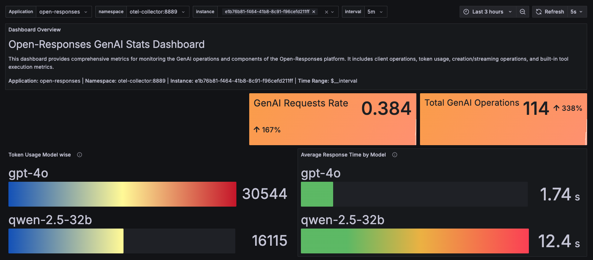
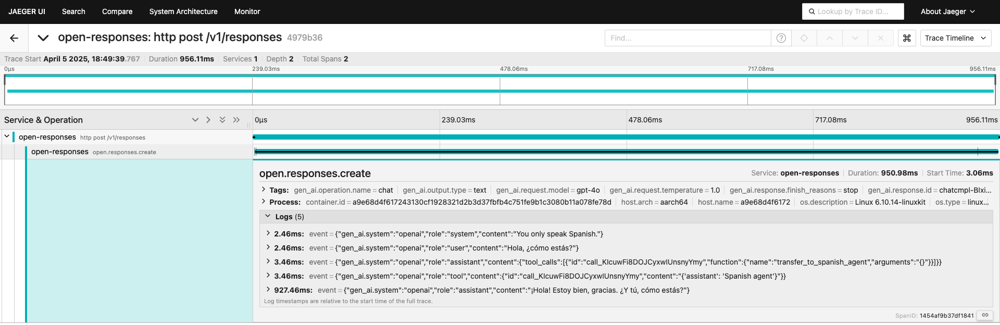
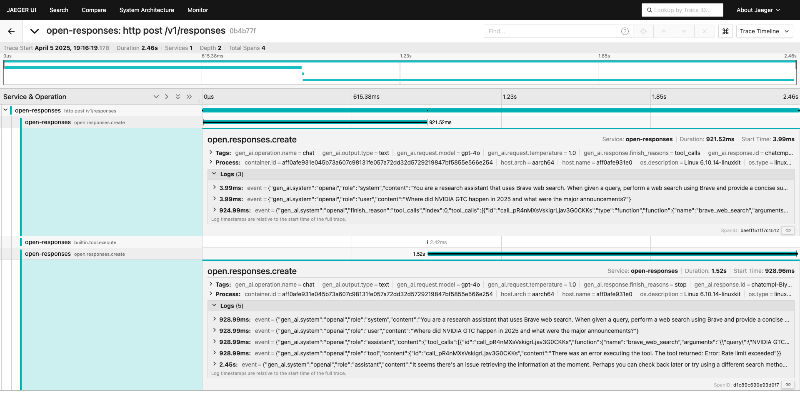

# Running Open Responses with Observability Stack

This guide provides step-by-step instructions for running the Open Responses service with the observability stack, which includes OpenTelemetry, Jaeger, Prometheus, and Grafana.

## Steps to Run Open Responses with Observability

1. Navigate to the observability infrastructure directory:
   ```bash
   cd observability/infra
   ```

2Start the observability stack:
   ```bash
   docker-compose up
   ```
   This will run the following services:
   - OpenTelemetry Collector
   - Jaeger
   - Prometheus
   - Grafana

3. Navigate back to open-responses directory. Run Open Responses service with OpenTelemetry enabled:
   ```bash
   docker-compose --profile mcp up open-responses-otel
   ```

4. **Note:** You might see momentary exceptions like:
   ```
   Failed to publish metrics to OTLP receiver (context: url=http://localhost:4318/v1/metrics)
   ```
   This is normal during startup.

5. Once all services are running properly, these errors should disappear.

6. Access the observability services through your browser:
   - Jaeger UI: http://localhost:16686/
   - Prometheus: http://localhost:9090/
   - Grafana: http://localhost:3000/

7. Grafana comes pre-loaded with production-ready dashboards in the folder 'Open Responses' at http://localhost:3000/dashboards. These include:
   - **Open-Responses GenAI Stats**: Contains generative AI performance and usage metrics
   - **Open-Responses Service Stats**: Contains service compute level metrics like CPU, memory usage, etc.

8. Run few times any of the curl examples mentioned in the [Quickstart guide](https://github.com/masaic-ai-platform/open-responses/blob/feature/otel-dashboards/docs/Quickstart.md#example-api-calls) to generate data. You should see statistics in the Grafana dashboards and traces in Jaeger.

9. You can also run examples from the OpenAI Agent SDK by following the instructions in the [Quickstart guide](https://github.com/masaic-ai-platform/open-responses/blob/feature/otel-dashboards/docs/Quickstart.md#6-running-agent-examples-built-with-openai-agent-sdk-to-use-open-responses-api-built-in-tools).

10. To generate enough datapoints for meaningful dashboard visualization, you can use the load generation examples available at: https://github.com/masaic-ai-platform/openai-agents-python/tree/main/examples/open_responses

    **Prerequisites**:
    - The service should be running as described in step #1
    - At least one model provider key is set (GROQ_API_KEY, OPENAI_API_KEY, or CLAUDE_API_KEY)

    **Examples**:
    1. Simple agent load generation:
       ```bash
       python -m examples.open_responses.agent_hands_off_for_load_generation
       ```
       You can choose the model provider of your choice (groq, openai, claude). The trace outcome is shown in agent_hands_off_for_load_genertion.png.

    2. Brave search agent load generation:
       ```bash
       python -m examples.open_responses.brave_search_agent_for_load_generation
       ```
       You can choose the model provider of your choice (groq, openai, claude). This requires the brave_web_search tool to be configured. The trace outcome is shown in brave_search_agent_for_load_generation.png.

## Observability in Action

The overall Prometheus state during load generation is shown below:



Here are the trace outcomes from the load generation examples:



 
